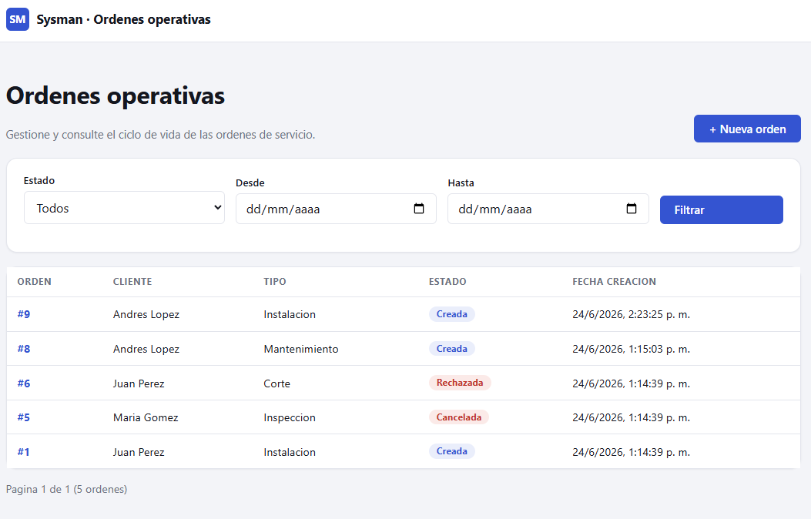

# Sysman

Proyecto de prueba para una evaluación técnica con Sysman: sistema de gestión de órdenes operativas (backend en Spring Boot + Oracle, frontend en Next.js).

## Demo en vivo

https://sysman.vercel.app/



## Estructura

```
sysman/
├── backend/    # API REST (Spring Boot + Oracle)
└── frontend/   # Next.js
```

## Requisitos

- Java 21
- Maven
- Docker (para levantar Oracle local)
- Node.js 18+

## Backend

1. Levantar Oracle local:

```bash
cd backend
docker compose up -d
```

2. Ejecutar la aplicación (perfil `dev` por defecto, aplica las migraciones automáticamente):

```bash
mvn -pl sysman-bootstrap spring-boot:run
```

La API queda disponible en `http://localhost:8080/api/v1`.
Swagger UI: `http://localhost:8080/swagger-ui/index.html`.

## Frontend

1. Instalar dependencias:

```bash
cd frontend
npm install
```

2. Crear un archivo `.env.local` con la URL del backend:

```
NEXT_PUBLIC_API_URL=http://localhost:8080/api/v1
```

3. Ejecutar en modo desarrollo:

```bash
npm run dev
```

La app queda disponible en `http://localhost:3000`.
